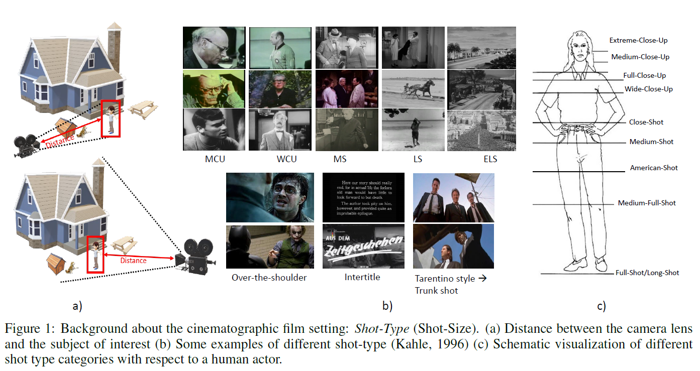
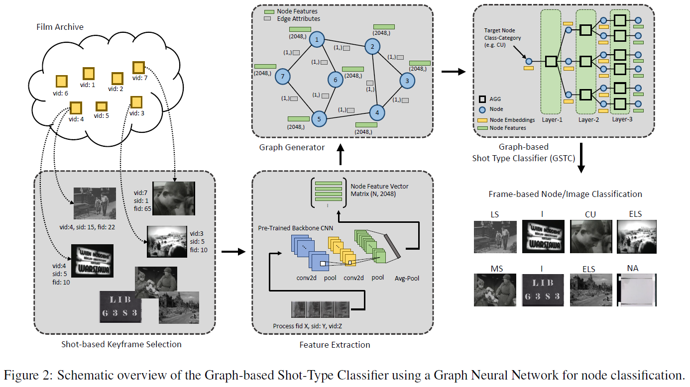
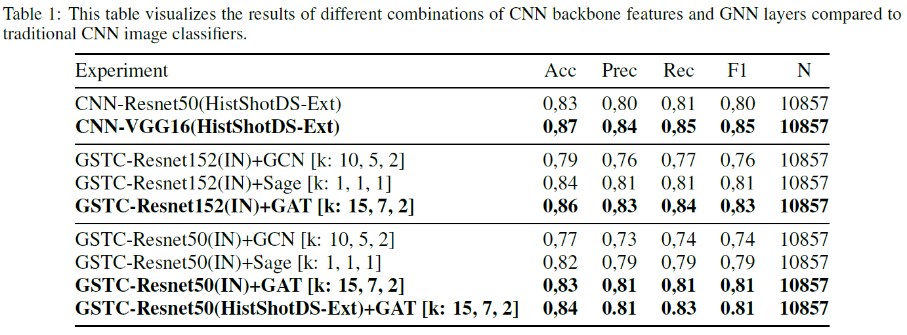
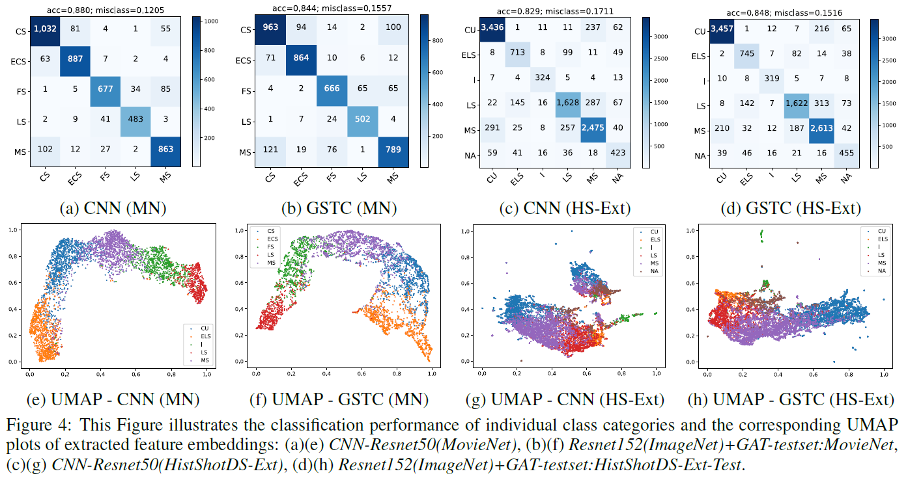

# Graph-based Shot Type Classifier

Paper title: Graph-Based Shot Type Classification in Large Historical Film Archives

Conference title: International Conference on Computer Vision Theory and Applications (VISAPP 2022)

## Description

To analyze films and documentaries (indexing, content understanding), a shot type classification is needed. State-of-the-art approaches use traditional CNN-based methods, which need large datasets for training (CineScale with 792000 frames or MovieShots with 46K shots). To overcome this problem, a Graph-based Shot TypeClassifier (GSTC) is proposed, which is able to classify shots into the following types: Extreme-Long-Shot (ELS), Long-Shot (LS), Medium-Shot (MS), Close-Up (CU), Intertitle (I), and Not Available/Not Clear (NA). The methodology is evaluated on standard datasets as well as a new published dataset: HistShotDS-Ext, including 25000 frames. The proposed Graph-based Shot Type Classifier reaches a classification accuracy of 86%.

## Dataset 

The dataset used in this investigation is based on the Historical Film Shot Dataset (HistShotDS-V1): 

HistShotDS(V1) - Zenodo: 

This dataset was extended and includes finally about 35000 labeled samples. Due to copyright issues we are only able to publish the annotations as well as the source of the films. All annotations are summarized in the Annotations_VISAPP2022.xlsx (HistShotDS-Extended --> [HistShotDS-Extended](annotations/)).

## Methodology

Details can be found in the paper.

## Results

Details can be found in the paper.

## Acknowledgement

Visual History of the Holocaust: Rethinking Curation in the Digital Age. This project has received funding from the European Union’s Horizon 2020 research and innovation program under the Grant Agreement 822670.

## References

VHH-MMSI: [https://vhh-mmsi.eu/](https://vhh-mmsi.eu/)

VHH-project Page: [https://www.vhh-project.eu/](https://www.vhh-project.eu/)

